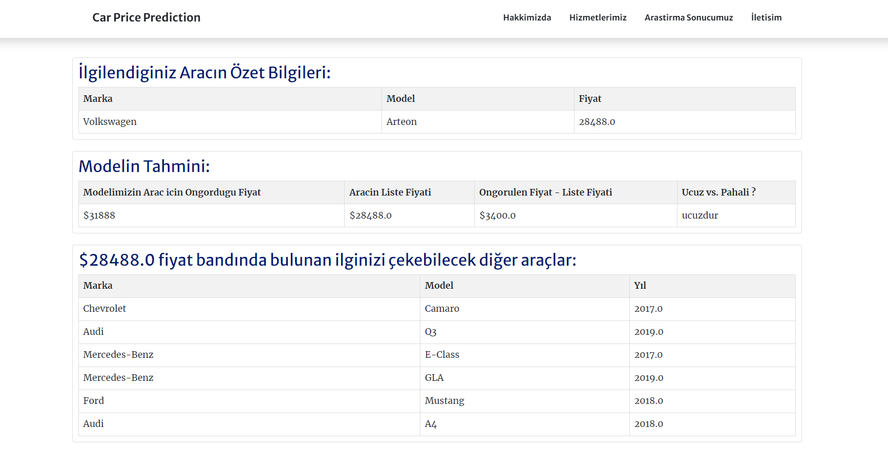

# Project Youtube Link

https://www.youtube.com/watch?v=k_Yed8yTAoM&ab_channel=CemSavas

# Description

This project has been prepared as a miuul data science bootcamp final project.

In this project, a machine learning model was trained with data scraped from 25,000 cars obtained through web scraping from cars.com. Afterwards, the trained ML model was integrated into a website using Django, allowing users to enter a link and obtain a price estimation for the corresponding vehicle in real-time.

Prepared by:

* Onurcan Bayrak: https://www.linkedin.com/in/onurcanbayrak/
* Canan Ceylan : https://www.linkedin.com/in/canan-ceylan/
* Merve Gamze Cinar : https://www.linkedin.com/in/mervegamzecinar/
* Cem Savas: https://www.linkedin.com/in/cemsavas/
* Tuğberk Karan: https://www.linkedin.com/in/tugberkkaran/

## How it Looks

